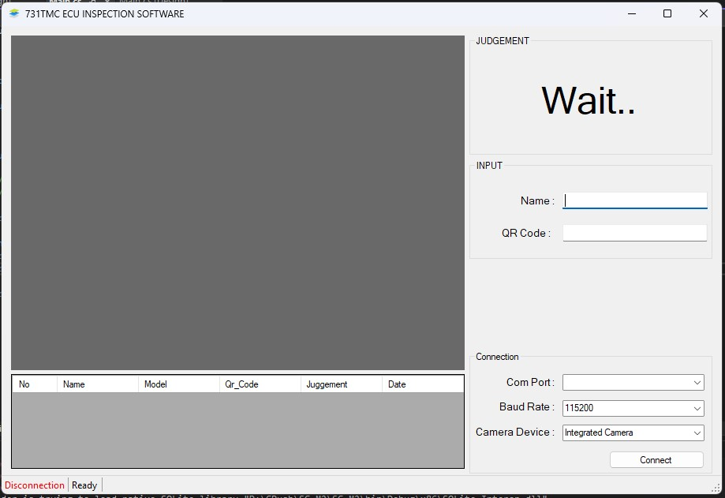

# Program checking compare data

This is a simple compare image

## How to use
1. Database: SQLite
2. IDE: Visual Studio 2022
3. Arduino 

## How to run
1. Open the solution in Visual Studio
2. Build the solution
3. Run the solution

<!-- Photo -->
## Image
 
 

    

## How to setting after run program
1. Click right to settting
2. Add model and close page
3. Select model and click edit to update image master
5. Close page setting and run test program